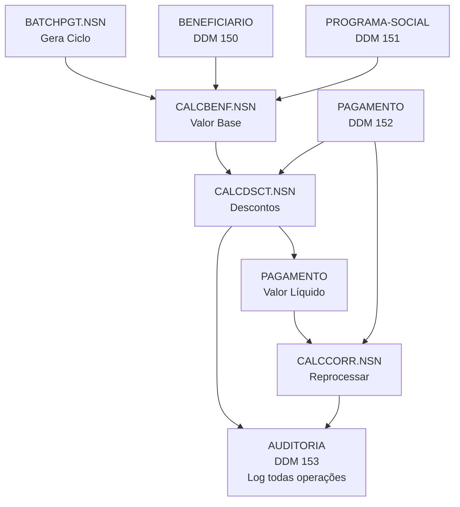

<!-- markdownlint-disable MD013 MD025 MD026 MD028 MD029 MD034 MD040 MD051 MD056 MD060 -->

# Regras de Negócio — Programas CALC.NSN

> **Data:** 2026-05-20  
> **Fonte:** Leitura de `natural-programs/CALC*.NSN`  
> **Objetivo:** Documentar lógica de cálculo para implementação em Estágio 3  
> **Responsáveis:** Developer (Par 3) + Technical Lead (Par 2)

---

## 📋 Índice

1. [CALCBENF.NSN](#calcbenfnsn) — Cálculo de benefício mensal
2. [CALCDSCT.NSN](#calcdsctnsn) — Cálculo de descontos e deduções
3. [CALCCORR.NSN](#calccorrnsn) — Cálculo de correção retroativa
4. [Matriz de Dependências](#-matriz-de-dependências)
5. [Integração com BATCHPGT](#-integração-com-batchpgt)

---

## 🎯 CALCBENF.NSN

**Responsável:** Carlos Roberto da Silva (criado 18/04/1997)  
**Alterações:** 5 atualizações até 08/03/2013  
**Objetivo:** Calcular valor benefício mensal de forma independente  
**Entrada:** CPF beneficiário + competência (AAAAMM)

### Estrutura de Cálculo

```
VLR_LIQUIDO = (VLR_BASE × FATOR_REGIONAL × FATOR_FAMILIAR × FATOR_RENDA × FATOR_REAJUSTE) - DESCONTOS
```

### 1️⃣ FATOR REGIONAL (27 posições — Estados + DF)

Multiplicador por região de residência (hardcoded em tabela):

| Índice | Estado | Fator | Região |
|--------|--------|-------|--------|
| 1 | AC | 1.3500 | **NORTE** |
| 2 | AM | 1.3200 | |
| 3 | AP | 1.3000 | |
| 4 | PA | 1.2800 | |
| 5 | RO | 1.3100 | |
| 6 | MA | 1.4000 | **NORDESTE** |
| 7 | PI | 1.3800 | |
| 8 | CE | 1.3500 | |
| 9 | BA | 1.3200 | |
| 10 | PE | 1.3600 | |
| 11 | SP | 1.1000 | **SUDESTE** |
| 12 | RJ | 1.1200 | |
| 13 | MG | 1.0800 | |
| 14 | ES | 1.0500 | |
| 15 | — | 1.0000 | **REF (base)** |
| 16 | PR | 1.0500 | **SUL** |
| 17 | SC | 1.0700 | |
| 18 | RS | 1.0300 | |
| 19 | MS | 1.1500 | **CENTRO-OESTE** |
| 20 | MT | 1.2000 | |
| 21 | GO | 1.1800 | |
| 22 | TO | 1.2500 | |
| 23 | DF | 1.1000 | |
| 24 | RR | 1.2200 | |
| 25 | SE | 1.3300 | |
| 26-27 | — | 1.0000 | **RESERVA** |

**Lógica:**
```
IF COD_REGIAO BETWEEN 1 AND 25
  FATOR_REGIONAL = TAB_REG[COD_REGIAO]
ELSE
  FATOR_REGIONAL = 1.0000  /* Default */
END-IF
```

**Nota:** Atualizado em 2004 (PORT. alteração 15/06/2004) — provavelmente mudança em fatores devido a novo mapa de regiões.

---

### 2️⃣ FATOR FAMILIAR (por número de dependentes)

Adição por dependente (máx 10 dependentes):

| Num Dependentes | Fórmula | Resultado |
|-----------------|---------|-----------|
| 0 | — | 1.0000 |
| 1 | 1.0000 + (1 × 0.0500) | 1.0500 |
| 2 | 1.0000 + (2 × 0.0500) | 1.1000 |
| 3 | 1.1000 + ((3-2) × 0.0300) | 1.1300 |
| 4 | 1.1000 + ((4-2) × 0.0300) | 1.1600 |
| 5+ | 1.1600 + ((NUM_DEP-4) × 0.0200) | 1.1600 + delta |

**Pseudocódigo:**
```
IF NUM_DEPENDENTES = 0
  FATOR_FAMILIAR = 1.0000
ELSE IF NUM_DEPENDENTES <= 2
  FATOR_FAMILIAR = 1.0000 + (NUM_DEPENDENTES × 0.0500)
ELSE IF NUM_DEPENDENTES <= 4
  FATOR_FAMILIAR = 1.1000 + ((NUM_DEPENDENTES - 2) × 0.0300)
ELSE
  FATOR_FAMILIAR = 1.1600 + ((NUM_DEPENDENTES - 4) × 0.0200)
END-IF
```

**Exemplo:**
- 3 dependentes: 1.1000 + (1 × 0.0300) = 1.1300
- 6 dependentes: 1.1600 + (2 × 0.0200) = 1.2000
- 10 dependentes: 1.1600 + (6 × 0.0200) = 1.2800

---

### 3️⃣ FATOR DE RENDA (5 faixas de renda familiar per capita)

Diminui benefício conforme renda cresce:

| Faixa # | Teto (R$) | Fator Multiplicador | Notas |
|---------|-----------|---------------------|-------|
| 1 | 300.00 | 1.0000 | 100% do valor base |
| 2 | 600.00 | 0.8500 | 85% |
| 3 | 1.000.00 | 0.7000 | 70% |
| 4 | 1.500.00 | 0.5500 | 55% |
| 5 | > 1.500.00 | 0.4000 | 40% |

**Lógica:**
```
FOR FAIXA = 1 TO 5
  IF RENDA_PER_CAPITA <= FAIXA_RENDA[FAIXA]
    FATOR_RENDA = FATOR_FAIXA[FAIXA]
    BREAK
  END-IF
END-FOR
```

**Exemplo:** Beneficiário com renda per capita de R$ 750/mês → cai na faixa 2 → fator 0.85

---

### 4️⃣ FATOR DE REAJUSTE (Programa-Social)

Vem do cadastro PROGRAMA-SOCIAL (DDM 151):
- Campo: `FATOR-REAJUSTE` (N3.4)
- Valor típico: 1.0000 ou atualizado anualmente
- Pode refletir inflação, política de ajuste do programa

**Alteração histórica:** 30/11/2001 (13º salário adicionado)

---

### 5️⃣ BENEFICIÁRIO DEVE ESTAR ATIVO

**Validações obrigatórias:**

```
FIND BENEFICIARIO WHERE CPF = #CPF
  IF NOT FOUND
    ERROR "BENEFICIARIO NAO ENCONTRADO"
  END-IF
  
  IF BENEFICIARIO.STATUS NE 'A'  /* Ativo */
    ERROR "BENEFICIARIO NAO ATIVO - STATUS: " & STATUS
  END-IF
  
  IF BENEFICIARIO.PROGRAMA.STATUS NE 'A'
    ERROR "PROGRAMA NAO ATIVO"
  END-IF
END-FIND
```

**Possíveis status:** A=Ativo, S=Suspenso, C=Cancelado, I=Inativo, D=Desligado

---

### 6️⃣ ADIÇÕES ESPECIAIS (13º + Abono)

**Alteração 30/11/2001:** Inclusão de cálculo de 13º salário
- Campo: `VLR-13` (N9.2)
- Cálculo: Provavelmente acumulativo (1/12 por mês ou pago em dezembro)

**Alteração 22/12/2009:** Abono natalino
- Campo: `VLR-ABONO` (N9.2)
- Cálculo: Aparentemente valor fixo ou percentual especial em mês específico

---

### 📊 Fórmula Completa (CALCBENF)

```
VLR_BRUTO = VLR_BASE_PROGRAMA 
          × FATOR_REAJUSTE
          × FATOR_REGIONAL[COD_REGIAO]
          × FATOR_FAMILIAR[NUM_DEPENDENTES]
          × FATOR_RENDA[RENDA_PER_CAPITA]

SE MES = 12 (DEZEMBRO)
  VLR_BRUTO += VLR_13_SALARIO
END-IF

SE MES = ESPECIAL (TBD)
  VLR_BRUTO += VLR_ABONO_NATALINO
END-IF

/* Descontos aplicados depois via CALCDSCT */
VLR_LIQUIDO = VLR_BRUTO - VLR_DESCONTO
```

---

## 💰 CALCDSCT.NSN

**Responsável:** Roberto Mendes Junior (criado 25/08/1999)  
**Alterações:** 2 atualizações até 30/09/2015  
**Objetivo:** Calcular descontos compulsórios e deduções  
**Entrada:** Número pagamento + CPF

### Tipos de Desconto Suportados

| Código | Nome | Cálculo | Teto 30% | Vigência |
|--------|------|---------|----------|----------|
| **J** | **Judicial** | Fixo OU % | ❌ **Sem teto** | Data início/fim |
| **P** | **Pensão Alimentícia** | Fixo OU % | ✅ Aplica | Data início/fim |
| **I** | **Imposto (IRRF)** | % apenas | ✅ Aplica | Data início/fim |
| **S** | **Sindical** | Fixo 1% | ✅ Aplica | Sem data |
| **A** | **Administrativo** | Fixo OU % | ✅ Aplica | Data início/fim |
| **C** | **Contribuição Social** | Tabela de faixas | ✅ Aplica | Obrigatório |

---

### 1️⃣ DESCONTO CONTRIBUIÇÃO SOCIAL (OBRIGATÓRIO)

Aplicado **sempre** — 4 faixas de renda:

| Faixa | Teto (R$) | Alíquota | Notas |
|-------|-----------|---------|-------|
| 1 | 500.00 | 3% | 0.03 |
| 2 | 1.000.00 | 5% | 0.05 |
| 3 | 2.000.00 | 7% | 0.07 |
| 4 | > 2.000.00 | 9% | 0.09 |

**Lógica:**
```
PERFORM CALC-CONTRIB-SOCIAL
FOR FAIXA = 1 TO 4
  IF VLR_BRUTO <= FAIXA_CONTRIB[FAIXA]
    DESCONTO_CONTRIB = VLR_BRUTO × ALIQ_CONTRIB[FAIXA]
    ADD TO VLR_TOTAL_DESCONTO
    BREAK
  END-IF
END-FOR
```

**Alteração:** 30/09/2015 — "novas alíquotas" (provavelmente aumento)

---

### 2️⃣ TETO MÁXIMO DE DESCONTO = 30% DO VALOR BRUTO

```
VLR_MAX_DESCONTO = VLR_BRUTO × 0.30
/* EXCETO descontos JUDICIAIS (J) — não têm teto */
```

**Truncamento para 2 casas decimais:**
```
VLR_TEMP = VLR_MAX_DESCONTO × 100
VLR_MAX_DESCONTO = VLR_TEMP / 100  /* Remove centavos além 0.01 */
```

---

### 3️⃣ DESCONTOS CADASTRADOS (Grupo Periódico)

Lidos do BENEFICIARIO.DESCONTOS (PE group, máx 8):

```
FOR CADA DESCONTO NO GRP_DESCONTOS
  /* Verificar vigência */
  IF DT_FIM_DESCONTO NE 0 AND DT_FIM_DESCONTO < DATA_HOJE
    SKIP  /* Desconto expirou */
  END-IF
  
  IF DT_INICIO_DESCONTO > DATA_HOJE
    SKIP  /* Desconto ainda não começou */
  END-IF
  
  /* Calcular por tipo */
  DECIDE ON TIPO_DESCONTO
    VALUE 'J'  /* JUDICIAL */
      IF VLR_DESCONTO > 0
        DESCONTO_ITEM = VLR_DESCONTO  /* Valor fixo */
      ELSE
        DESCONTO_ITEM = VLR_BRUTO × (PCT_DESCONTO / 100)
      END-IF
      ADD DESCONTO_ITEM TO VLR_TOTAL_DESCONTO
      /* NÃO APLICA TETO */
    
    VALUE 'P'  /* PENSÃO ALIMENTÍCIA */
      IF VLR_DESCONTO > 0
        DESCONTO_ITEM = VLR_DESCONTO
      ELSE
        DESCONTO_ITEM = VLR_BRUTO × (PCT_DESCONTO / 100)
      END-IF
      ADD DESCONTO_ITEM TO VLR_TOTAL_DESCONTO
      /* APLICA TETO */
    
    VALUE 'I'  /* IMPOSTO RETIDO */
      DESCONTO_ITEM = VLR_BRUTO × (PCT_DESCONTO / 100)
      ADD DESCONTO_ITEM TO VLR_TOTAL_DESCONTO
      /* APLICA TETO */
    
    VALUE 'S'  /* SINDICAL */
      DESCONTO_ITEM = VLR_BRUTO × 0.01  /* Fixo 1% */
      ADD DESCONTO_ITEM TO VLR_TOTAL_DESCONTO
      /* APLICA TETO */
    
    VALUE 'A'  /* ADMINISTRATIVO */
      IF VLR_DESCONTO > 0
        DESCONTO_ITEM = VLR_DESCONTO
      ELSE
        DESCONTO_ITEM = VLR_BRUTO × (PCT_DESCONTO / 100)
      END-IF
      ADD DESCONTO_ITEM TO VLR_TOTAL_DESCONTO
      /* APLICA TETO */
  END-DECIDE
  
  /* Aplicar teto de 30% (exceto judicial) */
  IF TIPO_DESCONTO NE 'J'
    IF VLR_TOTAL_DESCONTO > VLR_MAX_DESCONTO
      VLR_TOTAL_DESCONTO = VLR_MAX_DESCONTO
    END-IF
  END-IF
END-FOR
```

---

### 4️⃣ DESCONTO JUDICIAL (Caso Especial)

**Principais características:**
- Pode ser valor **fixo** ou **percentual**
- **Não tem teto** (ignora limite de 30%)
- Vinculado a processo judicial (campo NUM-PROCESSO)
- Deve ter datas de início/fim

**Exemplo:**
- Decisão judicial: R$ 500,00 mensais indefinidamente
- Ou: 15% do valor bruto até 31/12/2025

---

### 📊 Fórmula Completa (CALCDSCT)

```
VLR_DESCONTO_TOTAL = 0

/* Desconto obrigatório de contribuição social */
+ CALC_CONTRIB_SOCIAL(VLR_BRUTO)

/* Descontos cadastrados (até 8 tipos) */
+ SUM(DESCONTO_CADASTRADO) PARA CADA TIPO
  SE TIPO NE 'JUDICIAL' E TOTAL > 30% × VLR_BRUTO
    APLICAR_TETO_30_PORCENTO
  FIM

VLR_LIQUIDO = VLR_BRUTO - VLR_DESCONTO_TOTAL
```

**Truncamento final:**
```
VLR_TEMP = VLR_TOTAL_DESCONTO × 100
VLR_TOTAL_DESCONTO = VLR_TEMP / 100
```

---

## 📈 CALCCORR.NSN

**Responsável:** Patricia Gomes de Souza (criado 12/07/2001)  
**Alterações:** 2 atualizações até 15/08/2014  
**Objetivo:** Calcular correção retroativa usando índice IPCA  
**Entrada:** CPF + período (competência início/fim)

### Propósito

Reprocessar pagamentos históricos usando índices IPCA para:
- Compensar atrasos de reajuste
- Corrigir erros de cálculo anterior
- Atender decisões judiciais

---

### 1️⃣ TABELA IPCA (Valores Mensais)

**Carregada por ano — 12 meses cada:**

Exemplo — Ano 2010:

| Mês | Jan | Fev | Mar | Abr | Mai | Jun | Jul | Ago | Set | Out | Nov | Dez |
|-----|-----|-----|-----|-----|-----|-----|-----|-----|-----|-----|-----|-----|
| IPCA | 0.0075 | 0.0078 | 0.0052 | 0.0057 | 0.0043 | 0.0000 | 0.0001 | 0.0004 | 0.0045 | 0.0075 | 0.0083 | 0.0063 |

Similar para 2011-2014 (tabela hardcoded).

**⚠️ Nota crítica:** Tabela provavelmente desatualizada (2014 é limite). Para aplicação moderna, usar API do IBGE/IPCA.

---

### 2️⃣ LÓGICA DE CÁLCULO

**Etapa 1: Validar período**
```
IF COMPETENCIA_INICIAL > COMPETENCIA_FINAL
  ERROR "PERIODO INVALIDO"
END-IF
```

**Etapa 2: Para cada pagamento no período**
```
READ PAGAMENTO WHERE CPF = #CPF
  IF COMPETENCIA FORA DO RANGE [INICIAL, FINAL]
    SKIP
  END-IF
  
  IF JA_CORRIGIDO = 'S'
    SKIP  /* Evitar reprocessar */
  END-IF
  
  /* Calcular acúmulo de índices */
  IND_ACUMULADO = 1.000000
  PARA CADA MES DE COMPETENCIA_INICIAL ATÉ COMPETENCIA_DO_PAGAMENTO
    IND_ACUMULADO = IND_ACUMULADO × (1 + IPCA[ANO][MES])
  FIM
  
  /* Aplicar correção */
  VLR_CORRIGIDO = VLR_ORIGINAL × IND_ACUMULADO
  
  /* Truncar em 2 casas decimais */
  VLR_TEMP = VLR_CORRIGIDO × 100
  VLR_CORRIGIDO = VLR_TEMP / 100
  
  VLR_DIFERENCA = VLR_CORRIGIDO - VLR_ORIGINAL
  
  IF VLR_DIFERENCA > 0
    UPDATE PAGAMENTO
      SET VLR_CORRECAO = VLR_CORRIGIDO
      SET DT_CORRECAO = DATA_HOJE
      SET IND_CORRIGIDO = 'S'
    FIM
    ADD VLR_DIFERENCA TO TOTAL_CORRECAO
    ADD 1 TO QUANTIDADE_REGISTROS
  END-IF
END-READ
```

---

### 3️⃣ EXEMPLO PRÁTICO

**Cenário:**
- Beneficiário recebeu R$ 1.000,00 em janeiro/2010
- Corrigir pela inflação até maio/2010

**Cálculo:**
```
IND_IPCA_2010:
  Janeiro: 0.0075
  Fevereiro: 0.0078
  Março: 0.0052
  Abril: 0.0057
  Maio: 0.0043

IND_ACUMULADO = 1.000000
              × (1 + 0.0075)  = 1.007500
              × (1 + 0.0078)  = 1.015345
              × (1 + 0.0052)  = 1.020630
              × (1 + 0.0057)  = 1.026418
              × (1 + 0.0043)  = 1.030830

VLR_CORRIGIDO = 1.000,00 × 1.030830 = 1.030,83
VLR_DIFERENCA = 1.030,83 - 1.000,00 = 30,83
```

---

### 4️⃣ HISTÓRICO COMENTADO — PLANO VERÃO

⚠️ **Bloco comentado no código (preservado para histórico):**

```
/* CORRECAO PLANO VERAO - PERIODO 01/1989 A 01/1991
   UTILIZADO DURANTE TRANSICAO MOEDA CRUZADO->CRUZEIRO
   RESPONSAVEL: JOAO BATISTA - 15/03/2003
   
   IF COMPETENCIA_INICIAL >= 198901 AND COMPETENCIA_INICIAL <= 199101
     IND_ACUMULADO = IND_ACUMULADO × 2.7500
     IF COMPETENCIA_INICIAL < 198907
       IND_ACUMULADO = IND_ACUMULADO × 1.4289
     END-IF
     INDICADOR_CORRIGIDO = 'V'
   END-IF
*/
```

**Relevância para modernização:** Manter por compatibilidade histórica, mas implementar como caso especial em Java.

---

## 🔗 Matriz de Dependências



---

## 🔄 Integração com BATCHPGT

**BATCHPGT.NSN** (batch mensal):

```
Para cada ciclo:
  1. Ler todos beneficiários ATIVOS
  2. Para cada beneficiário:
     a. Chamar CALCBENF(cpf, competencia)
     b. Chamar CALCDSCT(num_pagamento)
     c. Armazenar resultado em PAGAMENTO (DDM 152)
  3. Para todo pagamento do ciclo:
     d. Registrar auditoria em AUDITORIA (DDM 153)
  4. Finalizar ciclo
  5. (Opcional) Chamar CALCCORR para período retroativo
```

---

## 📋 Checklist para Implementação (Estágio 3)

### CALCBENF (PaymentCalculationService)

- [ ] Criar `RegionalFactorTable` (27 regiões com fatores)
- [ ] Criar `IncomeRangeTable` (5 faixas com fatores)
- [ ] Implementar `calculateFamilyFactor(numDependents)` com lógica em 3 patamares
- [ ] Criar `BenefitCalculator.calculateGrossBenefit(cpf, competence)`
- [ ] Validar status beneficiário (A) e programa (A)
- [ ] Adicionar lógica de 13º salário (dezembro)
- [ ] Adicionar lógica de abono natalino (mês TBD)
- [ ] Testes unitários com exemplos de cálculo
- [ ] Testes comparativos Adabas vs PostgreSQL (precisão decimal)

### CALCDSCT (DiscountCalculationService)

- [ ] Criar `DiscountTypeEnum` (J, P, I, S, A, C)
- [ ] Implementar `calculateMandatorySocialTax(grossValue)` com 4 faixas
- [ ] Implementar `calculateDiscounts(beneficiario, grossValue)` para cada tipo
- [ ] Validar vigência de descontos (datas início/fim)
- [ ] Aplicar teto de 30% (com exceção para judicial)
- [ ] Testes para cada tipo de desconto
- [ ] Testes para teto máximo
- [ ] Testes de vigência (desconto fora de datas)

### CALCCORR (RetroactiveAdjustmentService)

- [ ] Criar `IPCAIndexTable` com dados 2010-2014
- [ ] Implementar `calculateAccumulatedIndex(startMonth, endMonth)`
- [ ] Implementar `applyRetroactiveCorrection(cpf, startCompetence, endCompetence)`
- [ ] Marcar como corrigido (IND_CORRIGIDO = 'S')
- [ ] Testes de cálculo acumulado
- [ ] Testes de truncamento decimal
- [ ] Considerar: API IBGE para dados atuais

### Geral

- [ ] Criar migrations Flyway para campos de cálculo em PAGAMENTO
- [ ] Criar enums para tipos de desconto/programa
- [ ] Criar testes BDD com cenários reais (Gherkin)
- [ ] Documento rastreabilidade: REQ-PAY-003 → PaymentCalculationService
- [ ] Documentar mystery field (FATOR-K em PROGRAMA-SOCIAL)

---

## 🎓 Notas Técnicas

### Precisão Decimal

Natural usa packed decimal (N9.2) — PostgreSQL usa NUMERIC(11,2).
**Validação crítica:** Testar truncamento vs arredondamento.

### Performance

- CALCBENF: Leitura simples (1 beneficiário) → índice em CPF
- CALCDSCT: Leitura com PE group (até 8 descontos) → busca de desconto periódico
- CALCCORR: Bulk read de período → query com BETWEEN
- **Indexação:** Criar índices em CPF, competência, status

### Auditoria

Cada cálculo deve ser registrado em AUDITORIA (DDM 153):
- COD-ACAO: 'BT' (batch) ou 'AL' (alteração manual)
- DES-ACAO: Qual cálculo foi executado
- CAMPO-ALTERADO-ANT/DEP: Valores antes/depois
- ID-CORRELACAO: UUID da execução do ciclo

---

**Próximo passo:** Usar este documento em Estágio 2 (`@architect`) para desenhar services Java 21 + Spring Boot.

