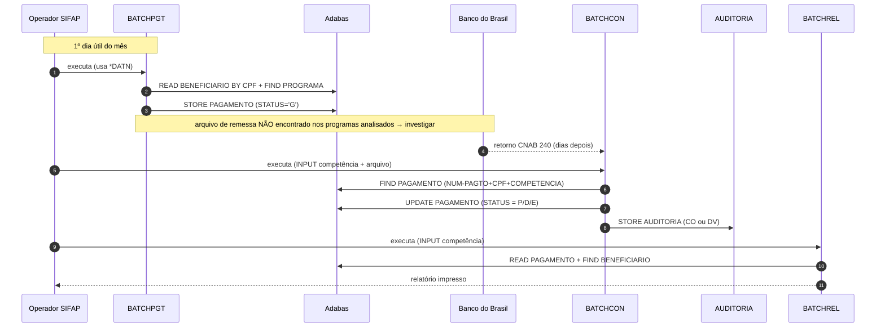
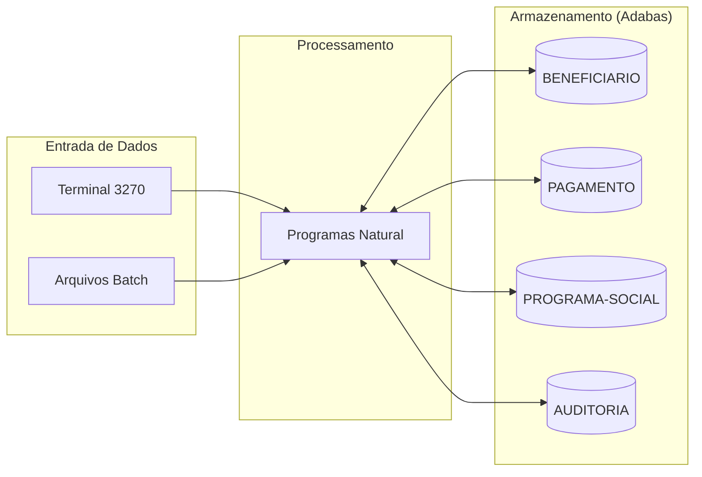

<!-- markdownlint-disable MD012 MD013 MD025 MD026 MD028 MD029 MD033 MD034 MD040 MD051 MD060 -->

# Mapa de Dependências — SIFAP Legado

  

> 🗺 **Você está aqui:** [Kit PT-BR](../README.md) → [Estágio 1](README.md) → **dependency-map**

> **Para quem é isto?** Este é um **artefato preenchido pelo time** durante o Estágio 1 (Arqueologia).
>
> **O que você terá ao final do estágio:**
>
> 1. Este documento totalmente preenchido com os dados reais do legado SIFAP
> 2. Rastreabilidade para `01-arqueologia/legado-sifap/` (programas `.NSN` e DDMs)
> 3. Base de evidência usada nas EARS do Estágio 2 (`source_legacy:`)
>
> 📘 **Guia passo a passo:** [`GUIDE.md`](GUIDE.md).

> Use diagramas Mermaid para mapear as dependências entre programas Natural e DDMs Adabas.
> O objetivo é visualizar "quem chama quem" e "quem lê/escreve o quê".

## Como descobrir dependências

- Use `grep` ou Copilot Chat para listar todas as ocorrências de `CALLNAT` nos 15 arquivos `.NSN`.
- Prompt útil: _"Liste todas as ocorrências de CALLNAT nestes arquivos e desenhe um diagrama Mermaid."_
- Para leitura/escrita em DDMs: procure por `READ`, `READ LOGICAL`, `STORE`, `UPDATE`, `DELETE`.

## Diagrama de Dependências entre Programas

> **Contribuição consolidada:** o diagrama abaixo unifica o mapa amplo deste PR com as descobertas do `develop` sobre os 3 batches do ciclo mensal.
>
> **Achado-chave:** não há `CALLNAT` entre os programas analisados; o acoplamento observado é via **tabelas Adabas compartilhadas** e `WORK FILE`.

```mermaid
flowchart TD
 classDef prog fill:#0f172a,stroke:#334155,color:#e2e8f0
 classDef data fill:#0f172a,stroke:#334155,color:#e2e8f0

 BATCHCON[BATCHCON.NSN]:::prog
 BATCHPGT[BATCHPGT.NSN]:::prog
 BATCHREL[BATCHREL.NSN]:::prog
 CADBENEF[CADBENEF.NSN]:::prog
 CADDEPEND[CADDEPEND.NSN]:::prog
 CADPROG[CADPROG.NSN]:::prog
 CALCBENF[CALCBENF.NSN]:::prog
 CALCCORR[CALCCORR.NSN]:::prog
 CALCDSCT[CALCDSCT.NSN]:::prog
 CONSBENF[CONSBENF.NSN]:::prog
 RELAUDIT[RELAUDIT.NSN]:::prog
 RELPGT[RELPGT.NSN]:::prog
 VALELEG[VALELEG.NSN]:::prog
 VALBENEF[VALBENEF.NSN]:::prog
 VALDOCS[VALDOCS.NSN]:::prog

 BENEF[(BENEFICIARIO)]:::data
 PAGTO[(PAGAMENTO)]:::data
 PROG[(PROGRAMA-SOCIAL)]:::data
 AUDIT[(AUDITORIA)]:::data
 WORK1[(WORK FILE 1)]:::data

 RELPGT -->|READ| PAGTO
 RELPGT -->|FIND| BENEF
 VALELEG -->|FIND| BENEF
 VALELEG -->|FIND| PROG
 CALCCORR -->|READ/UPDATE| PAGTO
 CALCDSCT -->|FIND/UPDATE| PAGTO
 CALCDSCT -->|FIND| BENEF
 CADDEPEND -->|FIND/UPDATE| BENEF
 CADBENEF -->|FIND/STORE/UPDATE| BENEF
 BATCHPGT -->|READ/FIND/STORE| PAGTO
 BATCHPGT -->|READ| BENEF
 BATCHPGT -->|FIND| PROG
 RELAUDIT -->|READ| AUDIT
 CADPROG -->|FIND/STORE| PROG
 CONSBENF -->|FIND| BENEF
 CONSBENF -->|READ| PAGTO
 CALCBENF -->|FIND| BENEF
 CALCBENF -->|FIND| PROG
 CALCBENF -->|STORE| PAGTO
 BATCHREL -->|READ| PAGTO
 BATCHREL -->|FIND| BENEF
 BATCHCON -->|READ/STORE| AUDIT
 BATCHCON -->|FIND/UPDATE| PAGTO
 BATCHCON -->|READ| WORK1
```

### Fluxo de negócio consolidado (sequence)

> O mapa consolidado acima cobre os **15 programas** e os **4 DDMs** identificados até aqui.

## Diagrama de Fluxo de Dados (DDMs)

> Substitua "DDM 3: ???" e "DDM 4: ???" pelos nomes reais encontrados em [`../01-arqueologia/legado-sifap/adabas-ddms/`](../01-arqueologia/legado-sifap/adabas-ddms/).

## Tabela de Dependências

| Programa      | Chama (CALLNAT) | Lê (READ) DDMs                          | Escreve (STORE/UPDATE) DDMs | Observações |
| ------------- | --------------- | ---------------------------------------- | --------------------------- | ----------- |
| BATCHCON.NSN  | -               | AUDITORIA, PAGAMENTO, WORK FILE 1        | AUDITORIA, PAGAMENTO        | Sub-rotinas `GRAVA-AUDITORIA-CONC`/`GRAVA-AUDITORIA-DIVERG`; bloco Banco Real comentado desde 2007 |
| BATCHPGT.NSN  | -               | BENEFICIARIO, PAGAMENTO, PROGRAMA-SOCIAL | PAGAMENTO                   | Cabeçalho cita CALCBENF/CALCDSCT, mas o cálculo está inline em `DET-FAIXA-RENDA-BATCH` |
| BATCHREL.NSN  | -               | BENEFICIARIO, PAGAMENTO                  | -                           | Read-only; faz `FIND BENEFICIARIO` por CPF a cada pagamento (N+1 reads) |
| CADBENEF.NSN  | -               | BENEFICIARIO                             | BENEFICIARIO                | Cadastro e atualização de beneficiário |
| CADDEPEND.NSN | -               | BENEFICIARIO                             | BENEFICIARIO                | Atualiza dependentes no registro do titular |
| CADPROG.NSN   | -               | PROGRAMA-SOCIAL                          | PROGRAMA-SOCIAL             | Cadastro de programa social |
| CALCBENF.NSN  | -               | BENEFICIARIO, PROGRAMA-SOCIAL            | PAGAMENTO                   | Cálculo de benefício com geração de pagamento |
| CALCCORR.NSN  | -               | PAGAMENTO                                | PAGAMENTO                   | Reprocessamento/correção de pagamento |
| CALCDSCT.NSN  | -               | BENEFICIARIO, PAGAMENTO                  | PAGAMENTO                   | Cálculo de desconto e atualização do pagamento |
| CONSBENF.NSN  | -               | BENEFICIARIO, PAGAMENTO                  | -                           | Consulta de beneficiário com histórico de pagamento |
| RELAUDIT.NSN  | -               | AUDITORIA                                | -                           | Relatório de auditoria |
| RELPGT.NSN    | -               | BENEFICIARIO, PAGAMENTO                  | -                           | Relatório de pagamentos |
| VALELEG.NSN   | -               | BENEFICIARIO, PROGRAMA-SOCIAL            | -                           | Validação de elegibilidade |
| VALBENEF.NSN  | -               | -                                        | -                           | Validações internas via PERFORM |
| VALDOCS.NSN   | -               | -                                        | -                           | Validações documentais via PERFORM |

## Dependências Circulares

## Arestas Programa-para-Programa

- Nenhuma aresta encontrada (CALLNAT/INCLUDE ausentes no escopo analisado).

## Arestas Programa-para-Dados (com evidência)

| Programa | Dado | Operação | Evidência |
| --- | --- | --- | --- |
| RELPGT.NSN | PAGAMENTO | READ | RELPGT.NSN:82 |
| RELPGT.NSN | BENEFICIARIO | FIND | RELPGT.NSN:104 |
| VALELEG.NSN | BENEFICIARIO | FIND | VALELEG.NSN:70 |
| VALELEG.NSN | PROGRAMA-SOCIAL | FIND | VALELEG.NSN:88 |
| CALCCORR.NSN | PAGAMENTO | READ | CALCCORR.NSN:128 |
| CALCCORR.NSN | PAGAMENTO | UPDATE | CALCCORR.NSN:162 |
| CALCDSCT.NSN | PAGAMENTO | FIND | CALCDSCT.NSN:74 |
| CALCDSCT.NSN | BENEFICIARIO | FIND | CALCDSCT.NSN:88 |
| CALCDSCT.NSN | PAGAMENTO | UPDATE | CALCDSCT.NSN:181 |
| CADDEPEND.NSN | BENEFICIARIO | FIND | CADDEPEND.NSN:46 |
| CADDEPEND.NSN | BENEFICIARIO | UPDATE | CADDEPEND.NSN:120 |
| CADBENEF.NSN | BENEFICIARIO | FIND | CADBENEF.NSN:139 |
| CADBENEF.NSN | BENEFICIARIO | STORE | CADBENEF.NSN:197 |
| CADBENEF.NSN | BENEFICIARIO | UPDATE | CADBENEF.NSN:213 |
| BATCHPGT.NSN | PAGAMENTO | READ | BATCHPGT.NSN:171 |
| BATCHPGT.NSN | BENEFICIARIO | READ | BATCHPGT.NSN:182 |
| BATCHPGT.NSN | PAGAMENTO | FIND | BATCHPGT.NSN:202 |
| BATCHPGT.NSN | PROGRAMA-SOCIAL | FIND | BATCHPGT.NSN:214 |
| BATCHPGT.NSN | PAGAMENTO | STORE | BATCHPGT.NSN:335 |
| RELAUDIT.NSN | AUDITORIA | READ | RELAUDIT.NSN:92 |
| CADPROG.NSN | PROGRAMA-SOCIAL | FIND | CADPROG.NSN:77 |
| CADPROG.NSN | PROGRAMA-SOCIAL | STORE | CADPROG.NSN:102 |
| CONSBENF.NSN | BENEFICIARIO | FIND | CONSBENF.NSN:88 |
| CONSBENF.NSN | PAGAMENTO | READ | CONSBENF.NSN:151 |
| CALCBENF.NSN | BENEFICIARIO | FIND | CALCBENF.NSN:148 |
| CALCBENF.NSN | PROGRAMA-SOCIAL | FIND | CALCBENF.NSN:167 |
| CALCBENF.NSN | PAGAMENTO | STORE | CALCBENF.NSN:286 |
| BATCHREL.NSN | PAGAMENTO | READ | BATCHREL.NSN:105 |
| BATCHREL.NSN | BENEFICIARIO | FIND | BATCHREL.NSN:112 |
| BATCHCON.NSN | AUDITORIA | READ | BATCHCON.NSN:88 |
| BATCHCON.NSN | WORK FILE 1 | READ | BATCHCON.NSN:106 |
| BATCHCON.NSN | PAGAMENTO | FIND | BATCHCON.NSN:139 |
| BATCHCON.NSN | PAGAMENTO | UPDATE | BATCHCON.NSN:178 |
| BATCHCON.NSN | AUDITORIA | STORE | BATCHCON.NSN:249 |

## PERFORM (intra-programa)

| Programa | PERFORM | Evidência |
| --- | --- | --- |
| RELPGT.NSN | IMPRIME-SUBTOTAL | RELPGT.NSN:94 |
| RELPGT.NSN | IMPRIME-CABECALHO | RELPGT.NSN:145 |
| VALELEG.NSN | VERIF-ELEG-ESPECIFICA | VALELEG.NSN:207 |
| CALCCORR.NSN | CALC-INDICE-ACUM | CALCCORR.NSN:149 |
| CALCDSCT.NSN | CALC-CONTRIB-SOCIAL | CALCDSCT.NSN:99 |
| VALDOCS.NSN | VALIDA-CPF-DOC | VALDOCS.NSN:68 |
| VALDOCS.NSN | VALIDA-RG | VALDOCS.NSN:78 |
| VALDOCS.NSN | CHECK-DOC-ESPECIAL | VALDOCS.NSN:88 |
| VALBENEF.NSN | VALIDA-CPF-COMPLETO | VALBENEF.NSN:115 |
| VALBENEF.NSN | VALIDA-DATA | VALBENEF.NSN:125 |
| VALBENEF.NSN | VALIDA-NOME | VALBENEF.NSN:135 |
| CADBENEF.NSN | VALIDA-CPF | CADBENEF.NSN:112 |
| BATCHPGT.NSN | DET-FAIXA-RENDA-BATCH | BATCHPGT.NSN:262 |
| RELAUDIT.NSN | IMPRIME-CAB-AUDIT | RELAUDIT.NSN:165 |
| CADPROG.NSN | CONSULTA-PROG | CADPROG.NSN:57 |
| CONSBENF.NSN | MASCARA-CPF | CONSBENF.NSN:107 |
| CALCBENF.NSN | DET-FAIXA-RENDA | CALCBENF.NSN:202 |
| CALCBENF.NSN | CALC-DESCONTOS | CALCBENF.NSN:263 |
| BATCHCON.NSN | GRAVA-AUDITORIA-DIVERG | BATCHCON.NSN:167 |
| BATCHCON.NSN | GRAVA-AUDITORIA-CONC | BATCHCON.NSN:201 |

## Referências quebradas

- Nenhuma referência quebrada de CALLNAT/INCLUDE foi detectada, porque não houve ocorrências dessas instruções nos .NSN analisados.

> Liste aqui qualquer dependência circular encontrada (programa A chama B que chama A):

- Nenhuma identificada entre os programas analisados até agora.

## Programas Órfãos

> Programas que não são chamados por nenhum outro (possíveis pontos de entrada ou código morto):

- Os 3 batches (`BATCHPGT`, `BATCHCON`, `BATCHREL`) são pontos de entrada operacionais, acionados por JCL/operador.
- Neste recorte, como não há CALLNAT/INCLUDE, os demais programas aparecem como candidatos a execução direta ou processamento isolado.
- Suspeita adicional: deve existir um programa de remessa CNAB de envio ao banco, pois nenhum dos programas analisados gera esse arquivo.

---

### Continuar a leitura

<table width="100%">
<tr>
<td width="50%" valign="top" align="left">
<strong>← ANTERIOR</strong> 
<a href="business-rules-catalog.md"><strong>business-rules-catalog.md</strong></a> 
Catálogo de regras.
</td>
<td width="50%" valign="top" align="right">
<strong>PRÓXIMO →</strong> 
<a href="discovery-report.md"><strong>discovery-report.md</strong></a> 
Síntese final.
</td>
</tr>
</table>

↑ <a href="README.md">Voltar ao Kit PT-BR</a>
