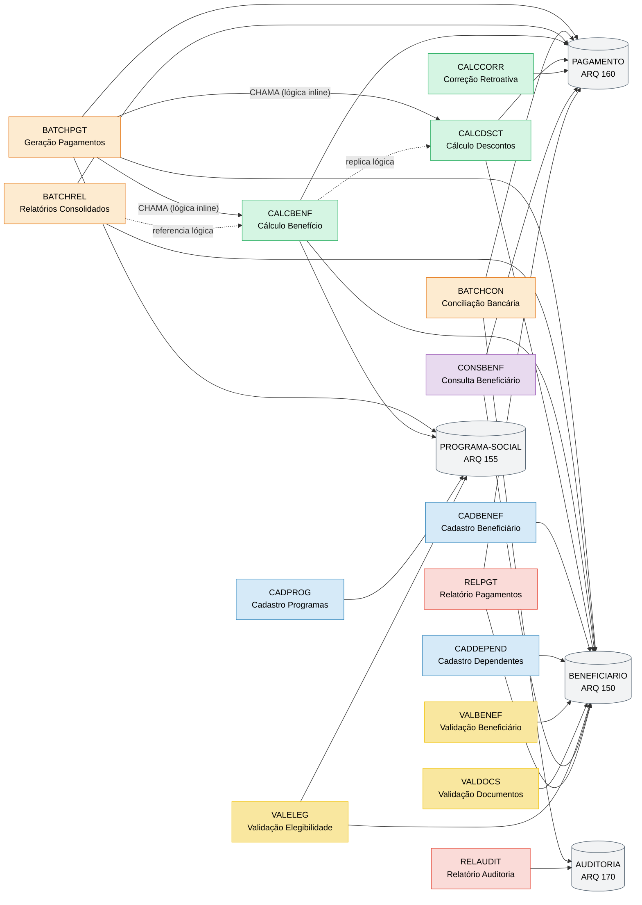
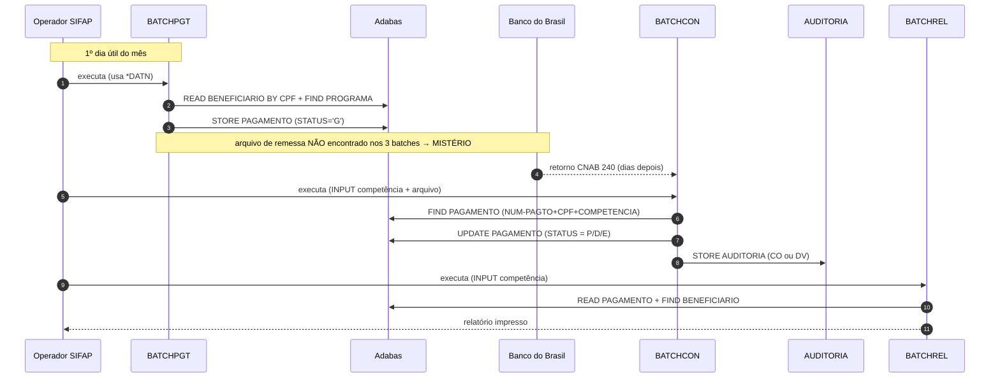
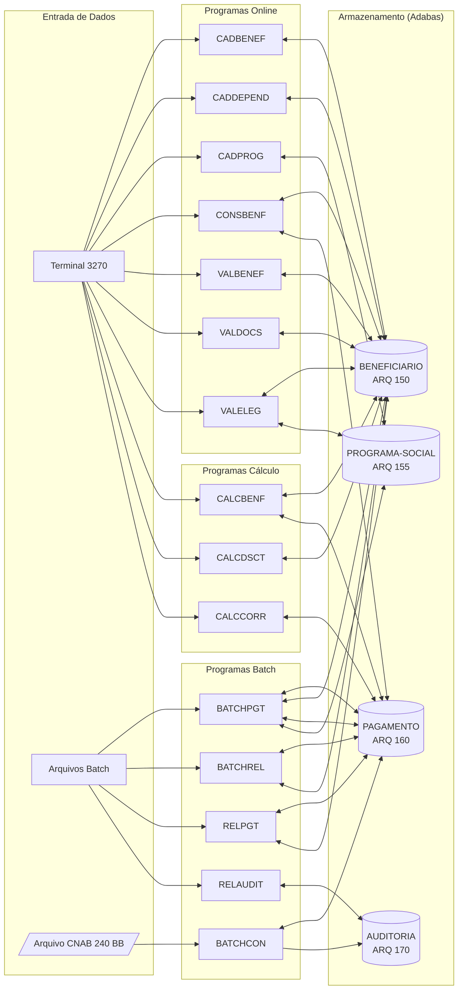

<!-- markdownlint-disable MD013 MD025 MD026 MD028 MD029 MD034 MD040 MD051 MD060 -->

# Mapa de Dependências — SIFAP Legado

  

> 🗺 **Você está aqui:** [Kit PT-BR](../README.md) → [Estágio 1](README.md) → **dependency-map**

> **Para quem é isto?** Este é um **artefato preenchido pelo time** durante o Estágio 1 (Arqueologia).
>
> **O que você terá ao final do estágio:**
>
> 1. Este documento totalmente preenchido com os dados reais do legado SIFAP
> 2. Rastreabilidade para `01-arqueologia/legado-sifap/` (programas `.NSN` e DDMs)
> 3. Base de evidência usada nas EARS do Estágio 2 (`source_legacy:`)
>
> 📘 **Guia passo a passo:** [`GUIDE.md`](GUIDE.md).

> Use diagramas Mermaid para mapear as dependências entre programas Natural e DDMs Adabas.
> O objetivo é visualizar "quem chama quem" e "quem lê/escreve o quê".

## Como descobrir dependências

- Use `grep` ou Copilot Chat para listar todas as ocorrências de `CALLNAT` nos 15 arquivos `.NSN`.
- Prompt útil: _"Liste todas as ocorrências de CALLNAT nestes arquivos e desenhe um diagrama Mermaid."_
- Para leitura/escrita em DDMs: procure por `READ`, `READ LOGICAL`, `STORE`, `UPDATE`, `DELETE`.

## Diagrama de Dependências entre Programas

> **Achado-chave:** nenhum `CALLNAT` em nenhum dos 15 programas. Todos usam `PERFORM` (sub-rotinas internas).
> O acoplamento entre programas é puramente via **tabelas Adabas compartilhadas** (contrato implícito de dados).
> O cabeçalho de `BATCHPGT` cita "CHAMA CALCBENF E CALCDSCT" — na prática a lógica foi duplicada inline para performance.

### Fluxo de negócio consolidado (sequence)

> **Instrução:** outros pares devem complementar com seus 12 programas restantes.

## Diagrama de Fluxo de Dados (DDMs)

## Tabela de Dependências

| Programa | Chama (CALLNAT) | Lê (READ/FIND) DDMs | Escreve (STORE/UPDATE) DDMs | Sub-rotinas internas (PERFORM) | Observações |
| ------------ | --------------- | -------------- | --------------------------- | ------------------------------ | ----------- |
| BATCHPGT.NSN | _nenhum_ | `BENEFICIARIO` (READ BY CPF), `PROGRAMA-SOCIAL` (FIND), `PAGAMENTO` (FIND) | `PAGAMENTO` (STORE) | `DET-FAIXA-RENDA-BATCH` | Cabeçalho cita CALCBENF/CALCDSCT mas código é inline |
| BATCHCON.NSN | _nenhum_ | `AUDITORIA` (READ BY SEQ DESC), `PAGAMENTO` (FIND), work file CNAB 240 | `PAGAMENTO` (UPDATE), `AUDITORIA` (STORE) | `GRAVA-AUDITORIA-CONC`, `GRAVA-AUDITORIA-DIVERG` | Bloco Banco Real comentado desde 2007 |
| BATCHREL.NSN | _nenhum_ | `PAGAMENTO` (READ BY COMPETENCIA), `BENEFICIARIO` (FIND) | _nenhum_ (read-only) | `IMPRIME-CABECALHO` | Saída flat file impressora mainframe |
| CALCBENF.NSN | _nenhum_ | `BENEFICIARIO` (FIND), `PROGRAMA-SOCIAL` (FIND), `PAGAMENTO` (FIND) | `PAGAMENTO` (STORE) | `DET-FAIXA-RENDA`, `CALC-DESCONTOS` | Programa interativo (INPUT); referencia lógica de CALCDSCT |
| CALCDSCT.NSN | _nenhum_ | `PAGAMENTO` (FIND), `BENEFICIARIO` (FIND) | `PAGAMENTO` (UPDATE) | `CALC-CONTRIB-SOCIAL` | Usa PE GROUP DESCONTOS; teto 30% exceto judicial |
| CALCCORR.NSN | _nenhum_ | `PAGAMENTO` (READ BY CPF-BENEF) | `PAGAMENTO` (UPDATE) | `CALC-INDICE-ACUM` | Tabela IPCA hardcoded 2010-2012; bloco Plano Verão comentado |
| CADBENEF.NSN | _nenhum_ | `BENEFICIARIO` (FIND) | `BENEFICIARIO` (STORE/UPDATE) | `VALIDA-CPF` | Inclusão e Alteração |
| CADDEPEND.NSN | _nenhum_ | `BENEFICIARIO` (FIND) | `BENEFICIARIO` (UPDATE PE GROUP) | _(nenhuma)_ | PE GROUP DEPENDENTES |
| CADPROG.NSN | _nenhum_ | `PROGRAMA-SOCIAL` (FIND) | `PROGRAMA-SOCIAL` (STORE/UPDATE) | `CONSULTA-PROG` | Inclusão/Consulta programas sociais |
| CONSBENF.NSN | _nenhum_ | `BENEFICIARIO` (FIND), `PAGAMENTO` (READ) | _nenhum_ (read-only) | `MASCARA-CPF` | Tela online 3270 (MAP) |
| RELPGT.NSN | _nenhum_ | `PAGAMENTO` (READ), `BENEFICIARIO` (FIND) | _nenhum_ (read-only) | `IMPRIME-SUBTOTAL`, `IMPRIME-CABECALHO` | Relatório analítico por período |
| RELAUDIT.NSN | _nenhum_ | `AUDITORIA` (READ) | _nenhum_ (read-only) | `IMPRIME-CAB-AUDIT` | Trilha de auditoria |
| VALBENEF.NSN | _nenhum_ | `BENEFICIARIO` (FIND) | _nenhum_ (validação) | `VALIDA-CPF-COMPLETO`, `VALIDA-DATA`, `VALIDA-NOME` | Validação dados cadastrais |
| VALDOCS.NSN | _nenhum_ | `BENEFICIARIO` (FIND) | _nenhum_ (validação) | `VALIDA-CPF-DOC`, `VALIDA-RG`, `CHECK-DOC-ESPECIAL` | Validação documentos |
| VALELEG.NSN | _nenhum_ | `BENEFICIARIO` (FIND), `PROGRAMA-SOCIAL` (FIND) | _nenhum_ (validação) | `VERIF-ELEG-ESPECIFICA` | Validação elegibilidade |

## Dependências Circulares

> Nenhuma dependência circular identificada entre os 15 programas (não há `CALLNAT`).

## Programas Órfãos

> Programas que não são chamados por nenhum outro (possíveis pontos de entrada ou código morto):

- **Todos os 15 programas são pontos de entrada independentes** — nenhum é chamado por outro via `CALLNAT`.
- Programas **batch** (BATCHPGT, BATCHCON, BATCHREL) são chamados por JCL/operador.
- Programas **online** (CADBENEF, CADDEPEND, CADPROG, CONSBENF, CALCBENF, CALCDSCT, CALCCORR, VALBENEF, VALDOCS, VALELEG) são acionados via terminal 3270.
- Programas **relatório** (RELPGT, RELAUDIT) são chamados por operador.
- **Suspeita:** deve existir um programa de **remessa CNAB de envio** ao BB — nenhum dos 15 gera esse arquivo. Investigar com PO/EA.

---

### Continuar a leitura

<table width="100%">
<tr>
<td width="50%" valign="top" align="left">
<strong>← ANTERIOR</strong> 
<a href="business-rules-catalog.md"><strong>business-rules-catalog.md</strong></a> 
Catálogo de regras.
</td>
<td width="50%" valign="top" align="right">
<strong>PRÓXIMO →</strong> 
<a href="discovery-report.md"><strong>discovery-report.md</strong></a> 
Síntese final.
</td>
</tr>
</table>

↑ <a href="README.md">Voltar ao Kit PT-BR</a>

