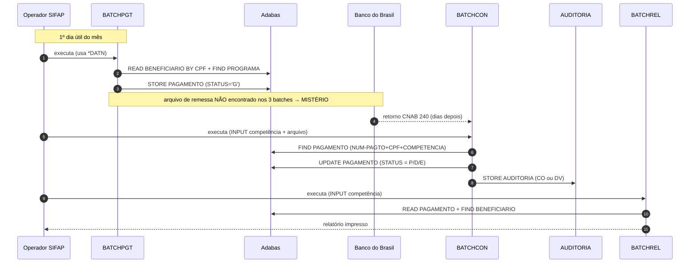

<!-- markdownlint-disable MD013 MD025 MD026 MD028 MD029 MD034 MD040 MD051 MD060 -->

# Mapa de Dependências — SIFAP Legado

  

> 🗺 **Você está aqui:** [Kit PT-BR](../README.md) → [Estágio 1](README.md) → **dependency-map**

> **Para quem é isto?** Este é um **artefato preenchido pelo time** durante o Estágio 1 (Arqueologia).
>
> **O que você terá ao final do estágio:**
>
> 1. Este documento totalmente preenchido com os dados reais do legado SIFAP
> 2. Rastreabilidade para `01-arqueologia/legado-sifap/` (programas `.NSN` e DDMs)
> 3. Base de evidência usada nas EARS do Estágio 2 (`source_legacy:`)
>
> 📘 **Guia passo a passo:** [`GUIDE.md`](GUIDE.md).


> Use diagramas Mermaid para mapear as dependências entre programas Natural e DDMs Adabas.
> O objetivo é visualizar "quem chama quem" e "quem lê/escreve o quê".

## Como descobrir dependências

- Use `grep` ou Copilot Chat para listar todas as ocorrências de `CALLNAT` nos 15 arquivos `.NSN`.
- Prompt útil: _"Liste todas as ocorrências de CALLNAT nestes arquivos e desenhe um diagrama Mermaid."_
- Para leitura/escrita em DDMs: procure por `READ`, `READ LOGICAL`, `STORE`, `UPDATE`, `DELETE`.

## Diagrama de Dependências entre Programas

> **Contribuição Par 2 (Arquitetura):** mapa dos 3 batches do ciclo mensal de pagamentos. Outros pares completam com seus programas.
>
> **Achado-chave:** nenhum `CALLNAT` entre os 3 batches. Acoplamento é puramente via **tabelas Adabas compartilhadas** (contrato implícito de dados).

```mermaid
flowchart TD
 subgraph CAD["Programas de Cadastro (Par 1 — Visão)"]
   CADBENEF["CADBENEF.NSN<br/>Cadastro Beneficiário<br/>ARQ 150"]
   CADDEPEND["CADDEPEND.NSN<br/>Cadastro Dependentes<br/>ARQ 150"]
   CADPROG["CADPROG.NSN<br/>Cadastro Programas<br/>ARQ 155"]
 end

 subgraph BATCH["Programas Batch (Par 2 — Arquitetura)"]
   BATCHPGT["BATCHPGT.NSN<br/>Batch Pagamentos"]
   BATCHREL["BATCHREL.NSN<br/>Batch Relatórios"]
   BATCHCON["BATCHCON.NSN<br/>Batch Consolidação"]
 end

 subgraph CALC["Programas de Cálculo (Par 3 — Implementação)"]
   CALCBENF["CALCBENF.NSN<br/>Cálculo Benefício"]
   CALCCORR["CALCCORR.NSN<br/>Cálculo Correção"]
   CALCDSCT["CALCDSCT.NSN<br/>Cálculo Desconto"]
 end

 subgraph VAL["Programas de Validação (Par 4 — Qualidade)"]
   VALBENEF["VALBENEF.NSN<br/>Validação Beneficiário"]
   VALDOCS["VALDOCS.NSN<br/>Validação Documentos"]
   VALELEG["VALELEG.NSN<br/>Validação Elegibilidade"]
 end

 subgraph CONS["Programas de Consulta/Relatório (Par 5 — Operações)"]
   CONSBENEF["CONSBENEF.NSN<br/>Consulta Beneficiário"]
   RELPGT["RELPGT.NSN<br/>Relatório Pagamentos"]
   RELAUDIT["RELAUDIT.NSN<br/>Relatório Auditoria"]
 end

 subgraph DDM["DDMs Adabas"]
   DDM_BENEF[("BENEFICIARIO<br/>ARQ 150<br/>~4,2M registros")]
   DDM_PROG[("PROGRAMA-SOCIAL<br/>ARQ 151<br/>~45 programas")]
   DDM_PGTO[("PAGAMENTO<br/>ARQ 160")]
   DDM_AUDIT[("AUDITORIA<br/>ARQ 170")]
 end

 CADBENEF -->|"STORE/UPDATE<br/>CADBENEF.NSN#L197,L213"| DDM_BENEF
 CADBENEF -->|"FIND<br/>CADBENEF.NSN#L139"| DDM_BENEF
 CADDEPEND -->|"FIND/UPDATE<br/>CADDEPEND.NSN#L46,L120"| DDM_BENEF
 CADPROG -->|"STORE<br/>CADPROG.NSN#L102"| DDM_PROG
 CADPROG -->|"FIND<br/>CADPROG.NSN#L77"| DDM_PROG

 BATCHPGT -->|READ/STORE| DDM_PGTO
 BATCHPGT -->|READ| DDM_BENEF
 BATCHPGT -->|CALLNAT| CALCBENF
 BATCHPGT -->|CALLNAT| CALCDSCT
 BATCHREL -->|READ| DDM_PGTO
 BATCHREL -->|READ| DDM_BENEF
 BATCHCON -->|READ/UPDATE| DDM_PGTO
 BATCHCON -->|STORE| DDM_AUDIT

 CALCBENF -->|READ| DDM_BENEF
 CALCBENF -->|READ| DDM_PROG
 CALCCORR -->|READ| DDM_PROG
 CALCDSCT -->|READ| DDM_BENEF

 VALBENEF -->|READ| DDM_BENEF
 VALDOCS -->|READ| DDM_BENEF
 VALELEG -->|READ| DDM_BENEF
 VALELEG -->|READ| DDM_PROG

 CONSBENEF -->|READ| DDM_BENEF
 RELPGT -->|READ| DDM_PGTO
 RELPGT -->|READ| DDM_BENEF
 RELAUDIT -->|READ| DDM_AUDIT
```



flowchart LR
 classDef batch fill:#FFF7E0,stroke:#FFB900,color:#0A0A0A
 classDef view fill:#E5F6FD,stroke:#00A4EF,color:#0A0A0A
 classDef ext fill:#F1F8E3,stroke:#7FBA00,color:#0A0A0A

 PGT[BATCHPGT<br/>geração mensal]:::batch
 CON[BATCHCON<br/>conciliação CNAB]:::batch
 REL[BATCHREL<br/>relatório consolidado]:::batch

 BEN[(BENEFICIARIO)]:::view
 PAG[(PAGAMENTO)]:::view
 PRG[(PROGRAMA-SOCIAL)]:::view
 AUD[(AUDITORIA)]:::view
 CNAB[/Arquivo CNAB 240 BB/]:::ext

 PGT -- READ BY CPF --> BEN
 PGT -- FIND --> PRG
 PGT -- FIND/STORE --> PAG

 CNAB -- READ WORK FILE --> CON
 CON -- FIND/UPDATE --> PAG
 CON -- STORE --> AUD

 REL -- READ BY COMPETENCIA --> PAG
 REL -- FIND --> BEN
```

### Fluxo de negócio consolidado (sequence)



> **Instrução:** outros pares devem complementar com seus 12 programas restantes.

## Diagrama de Fluxo de Dados (DDMs)


> DDMs preenchidos com os nomes reais encontrados em [`../01-arqueologia/legado-sifap/adabas-ddms/`](../01-arqueologia/legado-sifap/adabas-ddms/).

## Tabela de Dependências

| Programa | Chama (CALLNAT) | Lê (READ) DDMs | Escreve (STORE/UPDATE) DDMs | Observações |
| --- | --- | --- | --- | --- |
| **CADBENEF.NSN** | — (subroutine interna VALIDA-CPF) | BENEFICIARIO (FIND por CPF) | BENEFICIARIO (STORE inclusão, UPDATE alteração) | Par Visão; ARQ 150 |
| **CADDEPEND.NSN** | — | BENEFICIARIO (FIND por CPF titular) | BENEFICIARIO (UPDATE PE group) | Par Visão; dependentes embedded no mesmo ARQ 150 |
| **CADPROG.NSN** | — | PROGRAMA-SOCIAL (FIND por COD-PROGRAMA) | PROGRAMA-SOCIAL (STORE inclusão) | Par Visão; ARQ 155 |
| **BATCHPGT.NSN** | CALCBENF.NSN, CALCDSCT.NSN | BENEFICIARIO, PAGAMENTO | PAGAMENTO (STORE) | Par Arquitetura; batch noturno |
| **BATCHREL.NSN** | — | PAGAMENTO, BENEFICIARIO | — | Par Arquitetura; somente leitura |
| **BATCHCON.NSN** | — | PAGAMENTO | PAGAMENTO (UPDATE consolidação), AUDITORIA (STORE) | Par Arquitetura |
| **CALCBENF.NSN** | — | BENEFICIARIO, PROGRAMA-SOCIAL | — | Par Implementação; retorna valor calculado |
| **CALCCORR.NSN** | — | PROGRAMA-SOCIAL | — | Par Implementação; correção monetária |
| **CALCDSCT.NSN** | — | BENEFICIARIO | — | Par Implementação; regra 30% BR-013 |
| **VALBENEF.NSN** | — | BENEFICIARIO | — | Par Qualidade; validação de elegibilidade |
| **VALDOCS.NSN** | — | BENEFICIARIO | — | Par Qualidade; validação documental |
| **VALELEG.NSN** | — | BENEFICIARIO, PROGRAMA-SOCIAL | — | Par Qualidade; cruza regras de elegibilidade |
| **CONSBENEF.NSN** | — | BENEFICIARIO | — | Par Operações; somente consulta |
| **RELPGT.NSN** | — | PAGAMENTO, BENEFICIARIO | — | Par Operações; relatório |
| **RELAUDIT.NSN** | — | AUDITORIA | — | Par Operações; trilha de auditoria |

> Linhas preenchidas pelo Par 2. Outros pares completam.

| Programa | Chama (CALLNAT) | Lê (READ/FIND) DDMs | Escreve (STORE/UPDATE) DDMs | Observações |
| ------------ | --------------- | -------------- | --------------------------- | ----------- |
| BATCHPGT.NSN | _nenhum_ (cabeçalho cita CALCBENF/CALCDSCT mas código é inline — `BATCHPGT.NSN#L11`) | `BENEFICIARIO` (READ BY CPF), `PROGRAMA-SOCIAL` (FIND), `PAGAMENTO` (FIND) | `PAGAMENTO` (STORE) | Sub-rotina interna `DET-FAIXA-RENDA-BATCH`; lógica de cálculo duplicada inline |
| BATCHCON.NSN | _nenhum_ | `AUDITORIA` (READ BY SEQ DESC), `PAGAMENTO` (FIND), work file CNAB 240 | `PAGAMENTO` (UPDATE), `AUDITORIA` (STORE) | Sub-rotinas internas `GRAVA-AUDITORIA-CONC`, `GRAVA-AUDITORIA-DIVERG`; bloco Banco Real comentado desde 2007 |
| BATCHREL.NSN | _nenhum_ | `PAGAMENTO` (READ BY COMPETENCIA), `BENEFICIARIO` (FIND) | _nenhum_ (read-only — saída só em impressora) | N+1 reads no FIND BENEFICIARIO; paginação declarada mas não usada |

## Dependências Circulares

> Liste aqui qualquer dependência circular encontrada (programa A chama B que chama A):

- Nenhuma identificada entre os 3 batches do Par 2.

## Programas Órfãos

> Programas que não são chamados por nenhum outro (pontos de entrada diretos pelo terminal 3270 ou batch):

- **CADBENEF.NSN** — entrada direta pelo terminal; não é chamado por nenhum outro NSN
- **CADDEPEND.NSN** — entrada direta pelo terminal; não é chamado por nenhum outro NSN
- **CADPROG.NSN** — entrada direta pelo terminal; não é chamado por nenhum outro NSN
- **BATCHPGT.NSN** — ponto de entrada do job batch noturno; não é chamado por NSN
- **CONSBENEF.NSN** — consulta direta pelo terminal
- **RELPGT.NSN** — relatório direto pelo terminal ou batch
- **RELAUDIT.NSN** — relatório direto pelo terminal ou batch

> Nenhum programa morto identificado nos 15 NSN analisados — todos têm fluxo de entrada identificado.

- Os 3 batches do Par 2 são **pontos de entrada operacionais** (chamados por JCL/operador, não por outro `.NSN`).
- Suspeita: deve existir um 4º programa de **remessa CNAB de envio** ao BB — nenhum dos 3 batches gera esse arquivo. Investigar com PO/EA.

---

### Continuar a leitura

<table width="100%">
<tr>
<td width="50%" valign="top" align="left">
<sub><strong>← ANTERIOR</strong></sub><br/>
<a href="business-rules-catalog.md"><strong>business-rules-catalog.md</strong></a><br/>
<sub>Catálogo de regras.</sub>
</td>
<td width="50%" valign="top" align="right">
<sub><strong>PRÓXIMO →</strong></sub><br/>
<a href="discovery-report.md"><strong>discovery-report.md</strong></a><br/>
<sub>Síntese final.</sub>
</td>
</tr>
</table>

<sub>↑ <a href="README.md">Voltar ao Kit PT-BR</a></sub>

