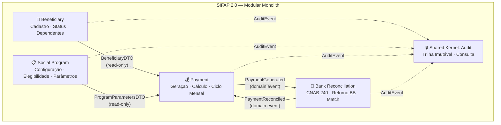
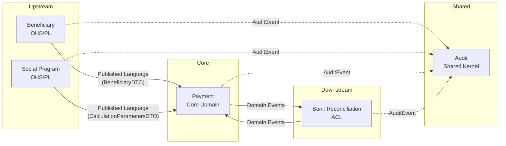

# Mapa de Bounded Contexts — SIFAP 2.0

> **Versão:** 1.0  
> **Data:** 2026-05-20  
> **Autores:** Par 2 (Enterprise Architect + Software Architect)  
> **Status:** Accepted

---

## Critérios de Avaliação

Cada hipótese de recorte do Estágio 1 foi avaliada contra três critérios:

| Critério | Definição | High = Bom |
|----------|-----------|------------|
| **Coesão** | As regras de negócio neste grupo se relacionam à mesma capacidade de negócio? | Sim — candidato forte |
| **Acoplamento** | Quantas dependências cruzam esta fronteira? | Poucas — candidato forte |
| **Frequência de Mudança** | Os componentes mudam juntos? | Sim — pertencem ao mesmo contexto |

---

## Avaliação de Hipóteses

### Hipótese 1: Beneficiary (Cadastro + Dependentes) — ACEITA ✅

**Programas incluídos:** CADBENEF, CADDEPEND, VALBENEF, VALDOCS, CONSBENEF  
**DDMs próprios:** BENEFICIARIO (ARQ 150) — ownership primário  
**Regras associadas:** BR-BENEF-001 a 006, BR-DEP-001 a 005 (11 regras)

| Critério | Score | Justificativa |
|----------|-------|---------------|
| Coesão | **HIGH** | Todas as regras tratam do ciclo de vida do beneficiário e seus dependentes |
| Acoplamento | **MEDIUM** | BENEFICIARIO é lido por 10/15 programas, mas a _escrita_ é exclusiva deste grupo |
| Frequência de Mudança | **HIGH** | CADBENEF e CADDEPEND compartilham ARQ 150 e regras de status interdependentes |

**Recomendação:** ACEITAR. A propriedade de escrita sobre BENEFICIARIO é clara. Leituras externas serão via interface pública (read-only DTO).

---

### Hipótese 2: Social Program (Configuração de Programas) — ACEITA ✅

**Programas incluídos:** CADPROG, VALELEG  
**DDMs próprios:** PROGRAMA-SOCIAL (ARQ 151) — ownership primário  
**Regras associadas:** BR-PROG-001 a 006 (6 regras)

| Critério | Score | Justificativa |
|----------|-------|---------------|
| Coesão | **HIGH** | Todas as regras tratam do cadastro e configuração de programas sociais |
| Acoplamento | **LOW** | PROGRAMA-SOCIAL é lido por BATCHPGT, CALCBENF, CALCCORR, VALELEG — mas escrita exclusiva de CADPROG |
| Frequência de Mudança | **HIGH** | Parâmetros de programas (VLR-BASE, FATOR-K, elegibilidade) mudam como unidade |

**Recomendação:** ACEITAR. Entidade paramétrica com ciclo de vida independente. Modifica raramente mas impacta muito — perfeito para contexto isolado com interface de consulta.

---

### Hipótese 3: Payment (Geração + Cálculo de Pagamento) — ACEITA ✅

**Programas incluídos:** BATCHPGT, CALCBENF, CALCDSCT  
**DDMs próprios:** PAGAMENTO (ARQ 160) — ownership primário  
**Regras associadas:** BR-PGT-001 a 018, BR-CALC-001 a 006, BR-DSCT-001 a 005, BR-CORR-001 a 003 (32 regras)

| Critério | Score | Justificativa |
|----------|-------|---------------|
| Coesão | **HIGH** | Todas as regras formam o pipeline de cálculo → geração → persistência de pagamentos |
| Acoplamento | **MEDIUM** | Lê de BENEFICIARIO e PROGRAMA-SOCIAL (cross-context), mas _escreve_ exclusivamente em PAGAMENTO |
| Frequência de Mudança | **HIGH** | Fatores regionais, faixas de renda, regras de desconto e arredondamento mudam juntas |

**Recomendação:** ACEITAR. Core domain do sistema. Contém a lógica financeira mais complexa. Inclui CALCBENF, CALCDSCT e CALCCORR como serviços internos do contexto (não expostos).

---

### Hipótese 4: Bank Reconciliation (Conciliação CNAB) — ACEITA ✅

**Programas incluídos:** BATCHCON  
**DDMs:** Lê/atualiza PAGAMENTO (ARQ 160), escreve AUDITORIA (ARQ 170)  
**Regras associadas:** BR-CON-001 a 011 (11 regras)

| Critério | Score | Justificativa |
|----------|-------|---------------|
| Coesão | **HIGH** | Todas as regras tratam exclusivamente de processar retorno CNAB 240 do BB |
| Acoplamento | **MEDIUM** | Atualiza STATUS em PAGAMENTO (cross-context), mas via transição de estado bem definida (G→P/D/E) |
| Frequência de Mudança | **MEDIUM** | Layout CNAB muda com versões FEBRABAN; regras de match são estáveis |

**Recomendação:** ACEITAR. Embora atualize PAGAMENTO, a responsabilidade é distinta (integração bancária vs. geração de pagamento). Comunicação via domain events: `PaymentReconciled`, `PaymentReturned`, `PaymentReversed`.

**Nota:** Separar de Payment porque:
1. Frequência de mudança diferente (CNAB depende do BB/FEBRABAN)
2. Regras de parsing de arquivo são completamente ortogonais ao cálculo de benefícios
3. Pode processar em horário diferente (ao receber retorno vs. batch noturno)

---

### Hipótese 5: Audit (Trilha de Auditoria) — ACEITA ✅ (como Shared Kernel)

**Programas incluídos:** RELAUDIT  
**DDMs próprios:** AUDITORIA (ARQ 170) — ownership primário  
**Regras associadas:** BR-CON-010, BR-CON-011, BR-DDM-002 (3 regras diretas + cross-cutting)

| Critério | Score | Justificativa |
|----------|-------|---------------|
| Coesão | **HIGH** | Responsabilidade única: registrar e consultar trilha imutável de eventos |
| Acoplamento | **HIGH** | Todo módulo escreve em auditoria — é cross-cutting por natureza |
| Frequência de Mudança | **LOW** | Estrutura de auditoria é estável; apenas novos tipos de ação são adicionados |

**Recomendação:** ACEITAR como **Shared Kernel**, não como bounded context autônomo. Implementado como módulo `shared/audit` acessível por todos os contextos via interface `AuditService`. Não possui API REST própria exceto para consulta (RELAUDIT).

---

### Hipótese 6: Reporting (Relatórios Consolidados) — REJEITADA ❌

**Programas incluídos:** BATCHREL, RELPGT  
**DDMs:** Apenas leitura de PAGAMENTO + BENEFICIARIO  
**Regras associadas:** BR-REL-001 a 005 (5 regras)

| Critério | Score | Justificativa |
|----------|-------|---------------|
| Coesão | **MEDIUM** | Relatórios são operações read-only que cruzam múltiplos contextos |
| Acoplamento | **HIGH** | Lê de PAGAMENTO, BENEFICIARIO — depende de todos os contextos sem possuir dados |
| Frequência de Mudança | **LOW** | Layout de relatório muda independentemente das regras de negócio |

**Recomendação:** REJEITAR como bounded context independente. Relatórios são **read models** derivados dos outros contextos. Implementar como:
- Views/projections dentro de cada contexto (cada um expõe seus dados de relatório)
- Um módulo `reporting` como infraestrutura transversal (não domínio)

---

## Bounded Contexts Finais

---

### 1. Beneficiary Context

- **Responsabilidade:** Gerenciar o ciclo de vida completo do beneficiário — cadastro, validação de CPF, gestão de dependentes, transições de status (A→S→C→D→I).
- **Dados próprios:** Tabela `beneficiaries` (migrada de BENEFICIARIO ARQ 150), tabela `dependents` (migrada de PE group GRP-DEPENDENTE).
- **Interface pública:**
  - `BeneficiaryQueryService.findActiveByCpf(cpf): Optional<BeneficiaryDTO>`
  - `BeneficiaryQueryService.findAllActive(): List<BeneficiaryDTO>`
  - `BeneficiaryQueryService.countDependents(beneficiaryId): int`
  - `BeneficiaryCommandService.register(command): BeneficiaryId`
  - `BeneficiaryCommandService.addDependent(command): DependentId`
  - `BeneficiaryCommandService.changeStatus(id, newStatus): void`
- **Por que é um contexto próprio:** Propriedade exclusiva sobre a entidade mais central do sistema (4,2M registros). Regras de validação de CPF, status e dependentes formam um conjunto coeso. Todos os outros contextos apenas _leem_ dados de beneficiário.

### 2. Social Program Context

- **Responsabilidade:** Configurar programas sociais — tipos (A/P/T), valor base, fator-k, vigência, elegibilidade.
- **Dados próprios:** Tabela `social_programs` (migrada de PROGRAMA-SOCIAL ARQ 151), tabela `program_parameters` (fatores regionais, faixas).
- **Interface pública:**
  - `ProgramQueryService.findActiveById(programId): Optional<ProgramParametersDTO>`
  - `ProgramQueryService.getCalculationParameters(programId): CalculationParametersDTO`
  - `ProgramCommandService.create(command): ProgramId`
  - `ProgramCommandService.updateParameters(command): void`
- **Por que é um contexto próprio:** Entidade paramétrica que muda raramente mas impacta todos os cálculos. Separar permite versionamento independente de parâmetros (fatores regionais, faixas de renda) sem tocar na lógica de pagamento.

### 3. Payment Context (Core Domain)

- **Responsabilidade:** Gerar ciclos mensais de pagamento, calcular valores de benefício (fórmula completa: regional × familiar × renda × idade × reajuste), aplicar descontos, gerir 13º e abono, controlar idempotência.
- **Dados próprios:** Tabela `payments` (migrada de PAGAMENTO ARQ 160), tabela `payment_cycles`, tabela `calculation_logs`.
- **Interface pública:**
  - `PaymentCycleService.generate(competencia, programId): PaymentCycleId`
  - `PaymentCycleService.getStatus(cycleId): CycleStatusDTO`
  - `PaymentQueryService.findByCpfAndCompetencia(cpf, competencia): Optional<PaymentDTO>`
  - Publica evento: `PaymentCycleGenerated { cycleId, competencia, totalPayments, totalAmount }`
- **Por que é um contexto próprio:** Contém 32 regras de negócio (45% do total), incluindo toda a lógica financeira crítica. Core domain do SIFAP. A complexidade de cálculo justifica isolamento total — nenhum outro contexto deve conhecer a fórmula de benefício.

### 4. Bank Reconciliation Context

- **Responsabilidade:** Processar arquivo retorno CNAB 240 do Banco do Brasil, fazer match por chave composta (NUM-PAGTO + CPF + COMPETENCIA), transicionar status de pagamentos (G→P/D/E), tratar divergências de valor.
- **Dados próprios:** Tabela `cnab_files` (metadados de arquivos processados), tabela `reconciliation_entries`.
- **Interface pública:**
  - `ReconciliationService.processReturnFile(fileContent): ReconciliationResultDTO`
  - `ReconciliationService.getUnreconciledPayments(cycleId): List<UnreconciledPaymentDTO>`
  - Publica eventos: `PaymentConfirmed`, `PaymentReturned`, `PaymentReversed`, `PaymentDivergent`
- **Por que é um contexto próprio:** Integração externa (BB/FEBRABAN) com parsing de formato proprietário (CNAB 240). Regras de match e tolerância de valor (R$ 0,01) são ortogonais ao cálculo. Muda quando o banco muda o layout.

### 5. Audit (Shared Kernel)

- **Responsabilidade:** Registrar trilha de auditoria imutável (append-only) para todas as operações do sistema. Prover consulta filtrada por período, usuário e tipo de ação.
- **Dados próprios:** Tabela `audit_events` (migrada de AUDITORIA ARQ 170).
- **Interface pública:**
  - `AuditService.record(event: AuditEvent): void`
  - `AuditQueryService.findByPeriod(start, end, filters): Page<AuditEventDTO>`
- **Por que é Shared Kernel:** Cross-cutting concern que todo contexto precisa usar. Não é um bounded context autônomo — é infraestrutura compartilhada com API bem definida.

---

## Comunicação Inter-Context

| De | Para | Mecanismo | Dados Trocados |
|----|------|-----------|----------------|
| Beneficiary → Payment | Interface síncrona | `BeneficiaryDTO` (id, cpf, status, numDependents, codRegiao, rendaFamiliar, dtNascimento) |
| Social Program → Payment | Interface síncrona | `CalculationParametersDTO` (vlrBase, fatorReajuste, tipoPrograma, statusProg) |
| Payment → Bank Reconciliation | Domain Event | `PaymentCycleGenerated` (cycleId, competencia, payments[]) |
| Bank Reconciliation → Payment | Domain Event | `PaymentReconciled/Returned/Reversed` (paymentId, status, dtPagamento) |
| All → Audit | Interface síncrona | `AuditEvent` (action, userId, entityType, entityId, timestamp, details) |

**Regra de ouro:** Dados de leitura cross-context transitam via DTOs imutáveis. Mutações cross-context transitam via domain events (eventual consistency).

---

## Diagrama Mermaid — Context Map (DDD)

**Legenda DDD:**
- **OHS** = Open Host Service (interface pública estável)
- **PL** = Published Language (DTOs versionados)
- **ACL** = Anti-Corruption Layer (parsing CNAB isolado do domínio)

---

## Decisões Registradas

- Reporting **não** é bounded context — é read model transversal (implementação no Estágio 3)
- Audit é **Shared Kernel** por ser cross-cutting (não bounded context autônomo)
- Payment inclui CALCBENF/CALCDSCT/CALCCORR como serviços internos (não expostos)
- Bank Reconciliation separado de Payment por frequência de mudança e responsabilidade distinta
- Comunicação Payment ↔ Reconciliation via **domain events** (acoplamento fraco)
- Comunicação Beneficiary/Program → Payment via **interfaces síncronas** (dados necessários no momento do cálculo)
