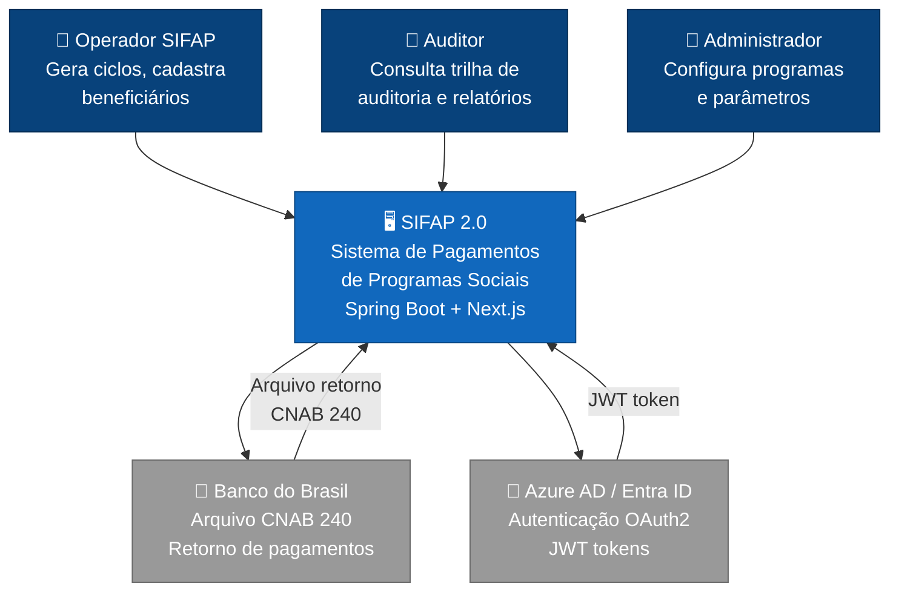
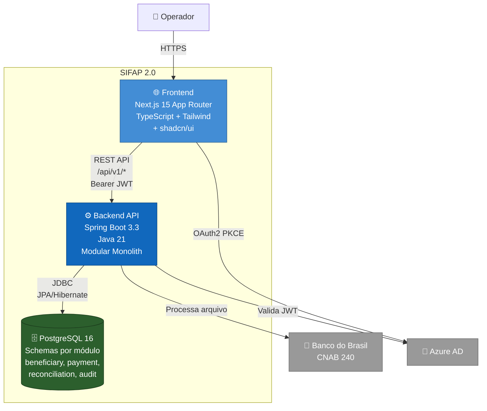
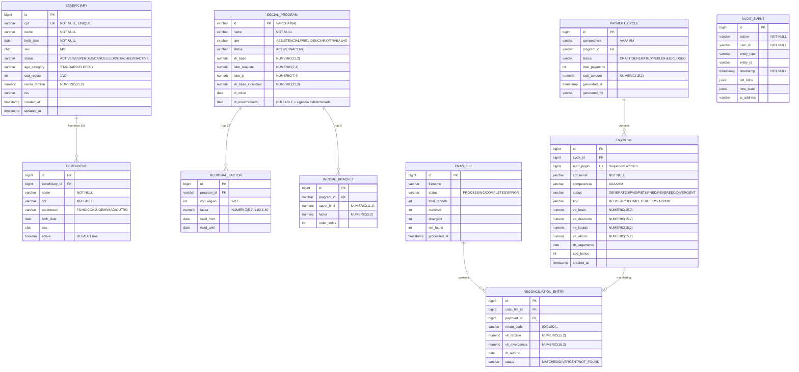

# Design do Modular Monolith — SIFAP 2.0

> **Versão:** 1.0  
> **Data:** 2026-05-20  
> **Autores:** Par 2 (Enterprise Architect + Software Architect)  
> **Base Package:** `com.datacorp.sifap`  
> **Comunicação Inter-Context:** Mista (interfaces síncronas + domain events)

---

## Estrutura de Packages

```
com.datacorp.sifap/
├── beneficiary/                    # Bounded Context: Beneficiary
│   ├── api/                        # REST controllers (público)
│   │   └── BeneficiaryController.java
│   ├── domain/                     # Entities, value objects (interno)
│   │   ├── Beneficiary.java        # Aggregate root
│   │   ├── Dependent.java          # Entity (child)
│   │   ├── Cpf.java                # Value object
│   │   ├── BeneficiaryStatus.java  # Enum: ACTIVE, SUSPENDED, CANCELLED, DETACHED, INACTIVE
│   │   └── AgeCategory.java        # Enum: STANDARD, ELDERLY
│   ├── service/                    # Business logic (interno)
│   │   ├── BeneficiaryCommandService.java
│   │   └── BeneficiaryQueryService.java
│   └── repository/                 # Data access (interno)
│       └── BeneficiaryRepository.java
│
├── socialprogram/                  # Bounded Context: Social Program
│   ├── api/
│   │   └── SocialProgramController.java
│   ├── domain/
│   │   ├── SocialProgram.java      # Aggregate root
│   │   ├── ProgramType.java        # Enum: ASSISTENCIAL, PREVIDENCIARIO, TRABALHO
│   │   ├── RegionalFactor.java     # Entity (configuração)
│   │   └── IncomeBracket.java      # Entity (configuração)
│   ├── service/
│   │   ├── ProgramCommandService.java
│   │   └── ProgramQueryService.java
│   └── repository/
│       └── SocialProgramRepository.java
│
├── payment/                        # Bounded Context: Payment (Core Domain)
│   ├── api/
│   │   └── PaymentCycleController.java
│   ├── domain/
│   │   ├── Payment.java            # Aggregate root
│   │   ├── PaymentCycle.java       # Entity
│   │   ├── PaymentStatus.java      # Enum: GENERATED, PAID, RETURNED, REVERSED, DIVERGENT
│   │   ├── PaymentType.java        # Enum: REGULAR, DECIMO_TERCEIRO, ABONO
│   │   └── Competencia.java        # Value object (AAAAMM)
│   ├── service/
│   │   ├── PaymentCycleService.java
│   │   ├── BenefitCalculationService.java   # Fórmula completa (REQ-012)
│   │   └── DiscountCalculationService.java  # Motor unificado (REQ-013)
│   ├── repository/
│   │   └── PaymentRepository.java
│   └── event/
│       └── PaymentCycleGenerated.java  # Domain event publicado
│
├── reconciliation/                 # Bounded Context: Bank Reconciliation
│   ├── api/
│   │   └── ReconciliationController.java
│   ├── domain/
│   │   ├── CnabFile.java           # Entity (metadados do arquivo)
│   │   ├── ReconciliationEntry.java # Entity
│   │   └── CnabReturnCode.java     # Enum: PAID, RETURNED, REVERSED, UNKNOWN
│   ├── service/
│   │   ├── ReconciliationService.java
│   │   └── CnabParser.java         # ACL — Anti-Corruption Layer
│   ├── repository/
│   │   └── ReconciliationRepository.java
│   └── event/
│       ├── PaymentConfirmed.java
│       ├── PaymentReturned.java
│       └── PaymentReversed.java
│
└── shared/                         # Shared Kernel
    ├── audit/
    │   ├── AuditService.java       # Interface pública
    │   ├── AuditEvent.java         # Record (DTO)
    │   ├── AuditEventEntity.java   # JPA Entity
    │   └── AuditRepository.java
    ├── exception/
    │   ├── BusinessException.java
    │   └── EntityNotFoundException.java
    ├── security/
    │   └── SecurityConfig.java     # OAuth2 Resource Server config
    └── event/
        └── DomainEventPublisher.java  # Spring ApplicationEventPublisher wrapper
```

---

## Interfaces de Módulo

### Beneficiary — Interface Pública

```java
public interface BeneficiaryQueryService {
    Optional<BeneficiaryDTO> findActiveByCpf(String cpf);
    List<BeneficiaryDTO> findAllActive(Pageable pageable);
    int countActiveDependents(Long beneficiaryId);
}

public interface BeneficiaryCommandService {
    Long register(RegisterBeneficiaryCommand command);
    Long addDependent(AddDependentCommand command);
    void changeStatus(Long id, BeneficiaryStatus newStatus);
}

// DTO que cruza fronteira de contexto (Published Language)
public record BeneficiaryDTO(
    Long id,
    String cpf,
    String name,
    BeneficiaryStatus status,
    AgeCategory ageCategory,
    int numDependents,
    int codRegiao,
    BigDecimal rendaFamiliar,
    LocalDate dtNascimento
) {}
```

### Social Program — Interface Pública

```java
public interface ProgramQueryService {
    Optional<ProgramParametersDTO> findActiveById(String programId);
    CalculationParametersDTO getCalculationParameters(String programId);
}

public interface ProgramCommandService {
    String create(CreateProgramCommand command);
    void updateParameters(UpdateParametersCommand command);
}

// DTO que cruza fronteira de contexto
public record CalculationParametersDTO(
    String programId,
    BigDecimal vlrBase,
    BigDecimal fatorReajuste,
    ProgramType tipo,
    List<RegionalFactorDTO> regionalFactors,
    List<IncomeBracketDTO> incomeBrackets
) {}
```

### Payment — Interface Pública

```java
public interface PaymentCycleService {
    Long generate(GenerateCycleCommand command);
    CycleStatusDTO getStatus(Long cycleId);
}

public interface PaymentQueryService {
    Optional<PaymentDTO> findByCpfAndCompetencia(String cpf, String competencia);
    Page<PaymentDTO> findByCycle(Long cycleId, Pageable pageable);
}

// Domain Event publicado para Bank Reconciliation
public record PaymentCycleGenerated(
    Long cycleId,
    String competencia,
    int totalPayments,
    BigDecimal totalAmount,
    Instant generatedAt
) {}
```

### Bank Reconciliation — Interface Pública

```java
public interface ReconciliationService {
    ReconciliationResultDTO processReturnFile(byte[] fileContent, String filename);
    List<UnreconciledPaymentDTO> getUnreconciled(Long cycleId);
}

// Domain Events publicados para Payment
public record PaymentConfirmed(Long paymentId, LocalDate paidDate, String bankCode) {}
public record PaymentReturned(Long paymentId, String returnCode) {}
public record PaymentReversed(Long paymentId, String returnCode) {}
```

### Audit (Shared Kernel) — Interface Pública

```java
public interface AuditService {
    void record(AuditEvent event);
}

public interface AuditQueryService {
    Page<AuditEventDTO> findByPeriod(LocalDateTime start, LocalDateTime end, AuditFilter filters);
}

public record AuditEvent(
    String action,
    String userId,
    String entityType,
    String entityId,
    Instant timestamp,
    String oldState,  // JSON
    String newState   // JSON
) {}
```

---

## Comunicação Cross-Context

### Padrão Escolhido: Misto

| Comunicação | Padrão | Justificativa |
|-------------|--------|---------------|
| Beneficiary → Payment | **Interface síncrona** | Payment precisa dos dados do beneficiário no momento do cálculo (não pode ser eventual) |
| Social Program → Payment | **Interface síncrona** | Parâmetros de cálculo devem ser consistentes no momento da geração |
| Payment → Reconciliation | **Domain Event** | Reconciliação processa em momento diferente; eventual consistency aceitável |
| Reconciliation → Payment | **Domain Event** | Transição de status pode ser eventual; idempotência garante consistência |
| All → Audit | **Interface síncrona** | Auditoria deve ser síncrona (garantia de registro antes de confirmar operação) |

### Implementação de Domain Events

```java
// Publicação (dentro do Payment context)
@Service
@Transactional
public class PaymentCycleServiceImpl implements PaymentCycleService {
    
    private final ApplicationEventPublisher eventPublisher;
    
    public Long generate(GenerateCycleCommand command) {
        // ... lógica de geração ...
        eventPublisher.publishEvent(new PaymentCycleGenerated(
            cycle.getId(), command.competencia(), totalPayments, totalAmount, Instant.now()
        ));
        return cycle.getId();
    }
}

// Consumo (dentro do Reconciliation context)
@Component
public class PaymentCycleEventListener {
    
    @EventListener
    public void onCycleGenerated(PaymentCycleGenerated event) {
        // Registrar que um ciclo está disponível para conciliação
    }
}
```

---

## Diagrama C4 — Level 1: System Context



---

## Diagrama C4 — Level 2: Containers



---

## Diagrama C4 — Level 3: Components (Backend)

```mermaid
graph TB
    classDef controller fill:#438DD5,stroke:#2E6295,color:#fff
    classDef service fill:#1168BD,stroke:#0B4884,color:#fff
    classDef repo fill:#2C5F2D,stroke:#1A3A1B,color:#fff
    classDef shared fill:#FF6B35,stroke:#CC5529,color:#fff
    classDef event fill:#9B59B6,stroke:#7D3C98,color:#fff

    subgraph "Beneficiary Module"
        BC[BeneficiaryController]:::controller
        BCS[BeneficiaryCommandService]:::service
        BQS[BeneficiaryQueryService]:::service
        BR[BeneficiaryRepository]:::repo
    end

    subgraph "Social Program Module"
        SPC[SocialProgramController]:::controller
        SPCS[ProgramCommandService]:::service
        SPQS[ProgramQueryService]:::service
        SPR[SocialProgramRepository]:::repo
    end

    subgraph "Payment Module (Core)"
        PC[PaymentCycleController]:::controller
        PCS[PaymentCycleService]:::service
        BCALC[BenefitCalculationService]:::service
        DCALC[DiscountCalculationService]:::service
        PR[PaymentRepository]:::repo
        PE[PaymentCycleGenerated]:::event
    end

    subgraph "Reconciliation Module"
        RC[ReconciliationController]:::controller
        RS[ReconciliationService]:::service
        CP[CnabParser ACL]:::service
        RR[ReconciliationRepository]:::repo
        RE1[PaymentConfirmed]:::event
    end

    subgraph "Shared Kernel"
        AS[AuditService]:::shared
        SEC[SecurityConfig]:::shared
        DEP[DomainEventPublisher]:::shared
    end

    %% Sync interfaces
    PCS -->|"BeneficiaryDTO"| BQS
    PCS -->|"CalculationParametersDTO"| SPQS
    
    %% Domain events
    PCS -->|"publish"| PE
    PE -->|"listen"| RS
    RS -->|"publish"| RE1
    RE1 -->|"listen"| PCS

    %% Shared
    BC & SPC & PC & RC -->|"AuditEvent"| AS
    BC & SPC & PC & RC -->|"JWT validation"| SEC
```



---

## Resumo de Endpoints (API Contract)

### Beneficiary Module — `/api/v1/beneficiaries`

| Method | Path | Summary | REQ |
|--------|------|---------|-----|
| POST | `/api/v1/beneficiaries` | Cadastrar novo beneficiário | REQ-001, REQ-002, REQ-003, REQ-004 |
| GET | `/api/v1/beneficiaries/{id}` | Consultar beneficiário por ID | — |
| GET | `/api/v1/beneficiaries?cpf={cpf}` | Buscar beneficiário por CPF | REQ-002 |
| PATCH | `/api/v1/beneficiaries/{id}/status` | Alterar status do beneficiário | REQ-005 |
| POST | `/api/v1/beneficiaries/{id}/dependents` | Adicionar dependente | REQ-005, REQ-006 |
| GET | `/api/v1/beneficiaries/{id}/dependents` | Listar dependentes do titular | — |

### Social Program Module — `/api/v1/programs`

| Method | Path | Summary | REQ |
|--------|------|---------|-----|
| POST | `/api/v1/programs` | Criar programa social | REQ-007, REQ-008, REQ-009 |
| GET | `/api/v1/programs/{id}` | Consultar programa e parâmetros | — |
| PUT | `/api/v1/programs/{id}/parameters` | Atualizar parâmetros de cálculo | REQ-009 |
| GET | `/api/v1/programs/{id}/factors` | Consultar fatores regionais e faixas | REQ-012 |

### Payment Module — `/api/v1/payments`

| Method | Path | Summary | REQ |
|--------|------|---------|-----|
| POST | `/api/v1/payment-cycles` | Gerar ciclo mensal de pagamento | REQ-010, REQ-011 |
| GET | `/api/v1/payment-cycles/{id}` | Consultar status do ciclo | — |
| GET | `/api/v1/payment-cycles/{id}/payments` | Listar pagamentos do ciclo | — |
| GET | `/api/v1/payments?cpf={cpf}&competencia={AAAAMM}` | Buscar pagamento específico | REQ-011 |

### Reconciliation Module — `/api/v1/reconciliation`

| Method | Path | Summary | REQ |
|--------|------|---------|-----|
| POST | `/api/v1/reconciliation/files` | Upload e processamento de retorno CNAB | REQ-016, REQ-017, REQ-018, REQ-019 |
| GET | `/api/v1/reconciliation/files/{id}` | Status do processamento | — |
| GET | `/api/v1/reconciliation/unreconciled?cycleId={id}` | Pagamentos não conciliados | REQ-019 |

### Audit (Shared) — `/api/v1/audit`

| Method | Path | Summary | REQ |
|--------|------|---------|-----|
| GET | `/api/v1/audit?start={}&end={}&action={}` | Consultar trilha de auditoria | REQ-020 |

---

## Modelo de Dados (Entity-Relationship)



---

## ADRs Relacionados

| ADR | Parte do Design Afetada |
|-----|------------------------|
| [ADR-001](ADRs/adr-001-mapeamento-adabas-postgresql.md) | Modelo de dados: PE group → `@OneToMany`, tipos de coluna, separação status/age_category |
| [ADR-002](ADRs/adr-002-motor-descontos-arredondamento.md) | Payment module: `DiscountCalculationService` com faixas + `HALF_EVEN` |
| [ADR-003](ADRs/adr-003-autenticacao-oauth2-jwt.md) | Shared/security: `SecurityConfig`, roles nos controllers, userId para audit |

---

## Convenções do Projeto

- **Package visibility:** Somente `api/` e interfaces em `service/` são públicas. Domain e repository são `package-private`.
- **DTOs cross-context:** Sempre Java `record` imutáveis.
- **Transações:** `@Transactional` apenas em services, nunca em controllers ou repositories.
- **Validação:** `@Valid` + Bean Validation em controllers; domain validation em entities.
- **Nomenclatura:** Classes em inglês, package-by-feature, sem sufixo redundante (não `BeneficiaryServiceImpl` — use `BeneficiaryCommandServiceImpl`).
